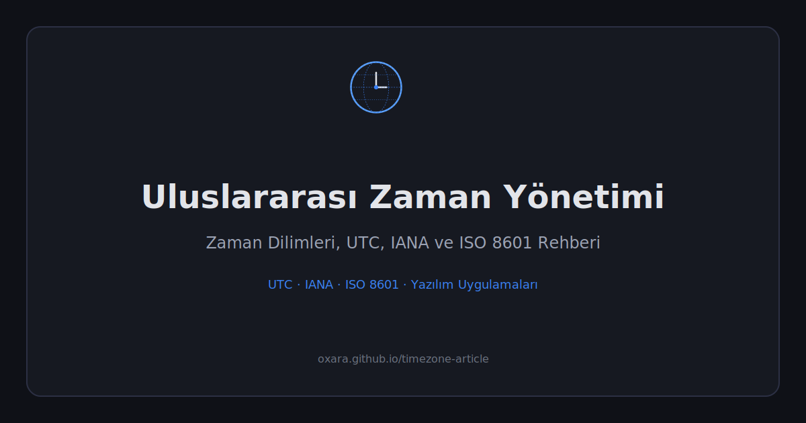

# Uluslararası Zaman Yönetimi: Zaman Dilimleri ve Uygulamaları

> Zaman dilimleri, UTC, GMT, DST, IANA veritabanı ve ISO 8601 hakkında kapsamlı Türkçe rehber.

🔗 **Canlı Site:** [oxara.github.io/timezone-article](https://oxara.github.io/timezone-article/)

---

## 📊 İçerik

| Metrik | Değer |
|--------|-------|
| Bölüm sayısı | 11 |
| Görsel | 8 |
| Okuma süresi | ~18 dk |
| Son güncelleme | Mayıs 2026 |
| IANA sürümü | 2026b |

## 📋 Kapsanan Konular

| Konu | Seviye |
|------|--------|
| Zaman Dilimleri Nedir? | 🟢 Temel |
| GMT ve Meridyen Sistemi | 🟢 Temel |
| Politik Saat Kararları (Türkiye kronolojisi) | 🟡 Orta |
| UTC, TAI, UT1 İlişkisi | 🟡 Orta |
| Leap Second ve CGPM 2035 Kararı | 🟠 İleri |
| Yaz Saati (DST) ve AB Tartışması | 🟡 Orta |
| Yaygın Yanılgılar | 🟡 Orta |
| Global Kaydet / Yerel Görüntüle Prensibi | 🟠 İleri |
| Microsoft vs IANA Veritabanları | 🟠 İleri |
| ISO 8601 Format Standardı | 🟡 Orta |
| Gelecek: 2035 ve Ötesi | 🟡 Orta |

## ✨ Özellikler

- 📱 Responsive makale düzeni (mobile-first)
- 🌙 Dark tema
- 📊 Okuma ilerleme çubuğu
- 🔝 Başa dön butonu
- 🖨️ Print-optimized
- 📈 GoatCounter analytics

## 🛠️ Teknoloji

Tek dosya HTML — harici framework yok. İçerik JavaScript template literal içinde Markdown olarak tutulur, [marked.js](https://github.com/markedjs/marked) ile render edilir.

## 📄 Lisans

MIT
